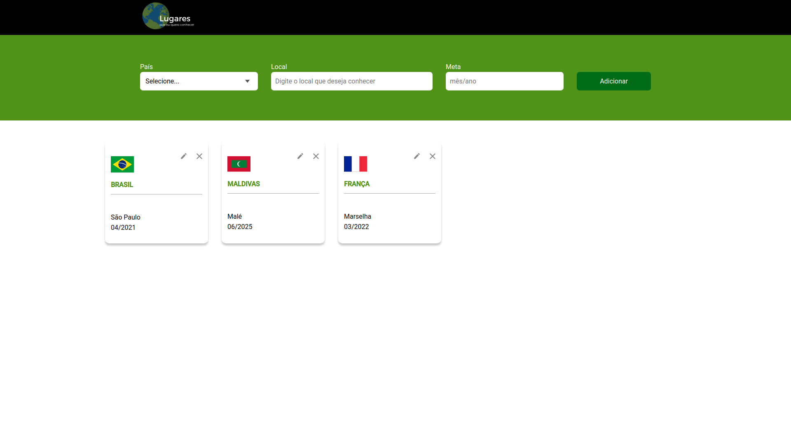

# places-crud-react

The project consists of being able to add places that the user wants to visit, for that the user must inform the country the place and the goal.

## How to run

1. Clone this repository;
2. run `yarn` to download the dependencies;
3. run `json-server server.json -p 3333 -w` to run the api from` json-server`;
3. run `yarn start` to run the project on` localhost: 3000;

## How to run tests

1. run `yarn cypress: open`
2. click on `filter-places.spec.ts` in the cypress test window
